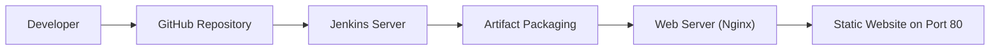
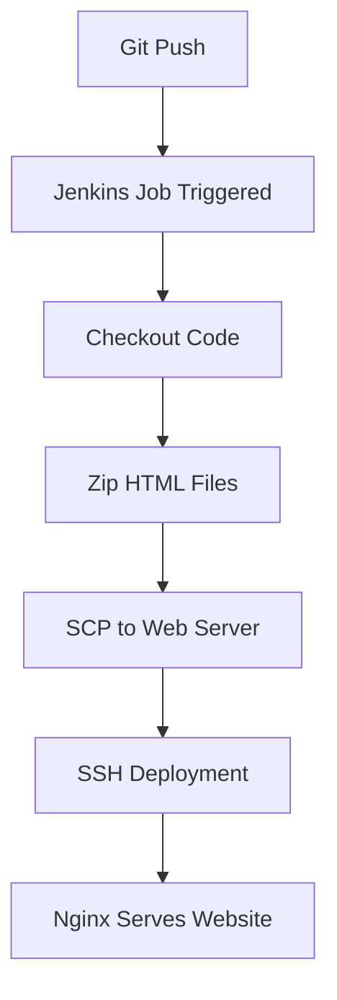
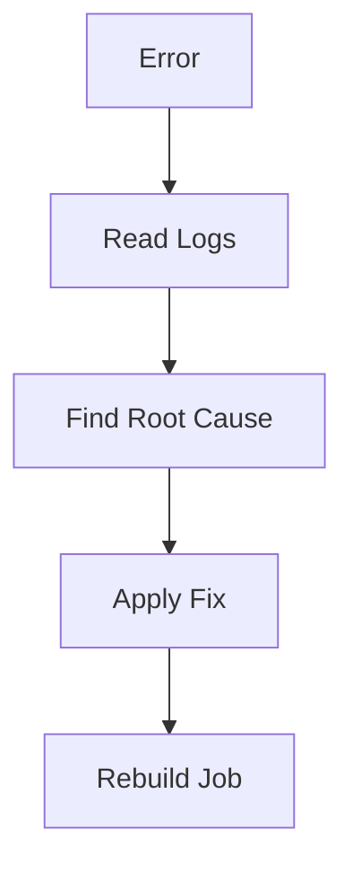
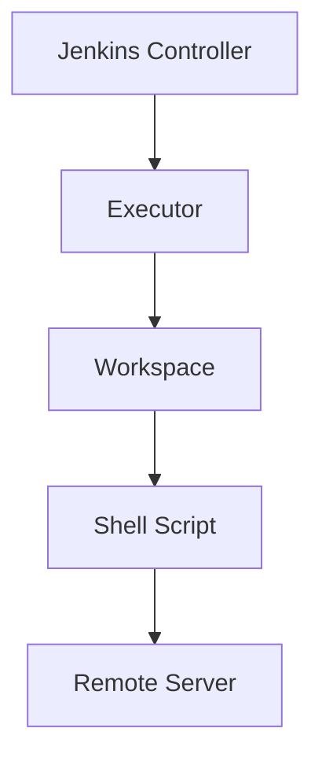

# 🚀 Jenkins CI/CD Pipeline for Static Website Deployment :-

> **Author:** Prasad Bhoite  
> **Role:** Cloud & DevOps Engineer (Fresher – Hands-on Project)  
> **Environment:** AWS EC2 (Ubuntu), Jenkins, Nginx, GitHub, Linux  

---

## 📌 Project Overview :-

In this project, **I designed and implemented an end-to-end Jenkins CI/CD pipeline** to deploy a **static website** using a **two-server architecture**.

The main objective was to automate the complete workflow:

- Pull source code from GitHub
- Package static website files
- Securely transfer artifacts between servers
- Deploy and host the website using **Nginx on Port 80**

This project represents **real-world DevOps practices**, including debugging Jenkins errors, Linux permission issues, and server-to-server deployments.

---

## 🧠 What I Did in This Project  :-(My Real Hands-On Work)

I personally:

- Set up **one Jenkins server** for CI/CD automation
- Set up **one Web Server (EC2)** for hosting a static website
- Integrated **GitHub with Jenkins (SCM)**
- Created a **Jenkins Freestyle Job**
- Wrote **Linux shell scripts** for deployment
- Used **SSH & SCP** for secure file transfer
- Installed and configured **Nginx**
- Opened **Port 80 (HTTP)** for public access
- Debugged real Jenkins issues (`zip not found`, PEM key path error, permission issues)

This project helped me understand **how Jenkins executes jobs internally** and how CI/CD pipelines work in production-like environments.

---

## 🧩 Technologies & Tools Used :-

| Technology | Purpose |
|----------|--------|
| Jenkins | CI/CD Automation |
| GitHub | Source Code Management |
| Nginx | Web Server |
| Ubuntu | Server OS |
| SSH / SCP | Secure Communication |
| HTML | Static Website |
| AWS EC2 | Cloud Infrastructure |

---
## 🏗️ Architecture Diagram :-
```
+-------------+        +---------------------+        +----------------------+
| Developer   | -----> | GitHub Repository   | -----> | Jenkins Server       |
| (Local PC)  |  Push  | (Source Code SCM)   |  Pull  | (CI/CD Automation)   |
+-------------+        +---------------------+        +----------+-----------+
                                                                      |
                                                                      | SCP / SSH
                                                                      v
                                                           +----------------------+
                                                           | Web Server           |
                                                           | (Nginx)              |
                                                           | Static Website Host  |
                                                           | Port 80 (HTTP)       |
                                                           +----------+-----------+
                                                                      |
                                                                      v
                                                           +----------------------+
                                                           | Users                |
                                                           | Access via Browser   |
                                                           +----------------------+

```
## 🏗️ High-Level Architecture :-


## 🔄 CI/CD Workflow :- (Step-by-Step)


## 🖥️ Infrastructure Details :-

### 1️⃣ Jenkins Server :-

- OS: Ubuntu
- Tool: Jenkins
  
- Responsibilities:
  - Pull code from GitHub
  - Package website files
  - Transfer artifacts securely
  - Trigger deployment

### 2️⃣ Web Server :-

- OS: Ubuntu 
- Web Server: Nginx
- Port: 80 (HTTP)
  
- Responsibilities:
  - Host static website
  - Serve HTML files publicly
  
## 📂 Project Structure :-
```arduino
My-Web-Deploy/
│
├── index.html
├── home.html
├── README.md
```
## 🌐 Website Pages :-

- index.html → Main landing page
- home.html → Secondary content page

Deployment directory on web server :
```css
/var/www/html
```
## 🔐 Network & Security Configuration :-

Web Server Security Group :-

| Type | Protocol | Port | Source |
|------|----------|------|--------|
| HTTP | TCP | 80 | 0.0.0.0/0 |
| SSH  | TCP | 22 | Jenkins Server IP |

✔ **Port 80 (HTTP)** is open to the public for website access  
✔ **Port 22 (SSH)** is restricted to the Jenkins Server for secure deployments

## ⚙️ Jenkins Job Configuration :-

- Job Type: ***Freestyle Project***
- Source Code Management: ***Git***
- Repository URL:
```arduino
https://github.com/Prasad-bhoite19/My-Web-Deploy.git
```

- Build Step: ***Execute Shell***
## 🔑 Prerequisites :-

Copy your SSH private key (.pem file) from your local laptop to the Jenkins server. This enables Jenkins to securely connect to the Web Server for deployment.

- #### How to copy the SSH key: 
> Run this command on your local laptop
```
scp -i /path/to/local/private_key.pem /path/to/local/private_key.pem ubuntu@<JENKINS_SERVER_IP>:/home/ubuntu/
```

## ⚙️ Jenkins Execute Shell Script :-

The following **Execute Shell** script is used in the **Jenkins Freestyle Job** to automate the deployment of a static website from the Jenkins server to a remote Web Server using **SSH and SCP**.

> **Important:** Ensure the SSH private key (`<your-pem-secret-key>`) is copied to the Jenkins server at `/home/ubuntu/`

- #### Update package list on Jenkins server :-
```
sudo apt update
```
- #### Install zip utility on Jenkins server :-
```
sudo apt install zip -y
```
- #### Create a zip archive of all HTML files :-
```
zip myfile.zip ./*.html
```
- #### Set correct permissions for SSH private key :-
```
sudo chmod 600 /home/ubuntu/<your-pem-secret-key>
```
- #### Copy the zip file to the Web Server :-
```
sudo scp -i /home/ubuntu/<your-pem-secret-key> -o StrictHostKeyChecking=no myfile.zip ubuntu@<your-web-server-public-ip>:.
```
- #### Connect to the Web Server and deploy the website :-
```
sudo ssh -i /home/ubuntu/<your-pem-secret-key> -o StrictHostKeyChecking=no ubuntu@<your-web-server-public-ip><< EOF
```
- #### Update packages on Web Server :-
```
sudo apt update
```
- #### Install Nginx web server :-
```
sudo apt install nginx -y
```
- #### Install zip utility on Web Server :-
```
sudo apt install zip -y
```
- #### Copy website archive to Nginx root directory :-
```
sudo cp myfile.zip /var/www/html
```
- #### Navigate to Nginx web root :-
```
cd /var/www/html
```
- #### Remove old HTML files :-
```
sudo rm *.html
```
- #### Extract new website files :-
```
sudo unzip myfile.zip
```
- #### Verify website deployment :-
```
curl http://localhost
```

### 🔍 Script Explanation :-

- **apt update / install zip** → Ensures required packages are available
- **zip myfile.zip** → Packages all HTML files into a single artifact
- **chmod 600** → Secures the SSH private key
- **scp** → Transfers the artifact to the Web Server
- **ssh** → Logs into the Web Server for deployment
- **nginx** → Hosts the static website
- **unzip** → Extracts website files into `/var/www/html`
- **curl localhost** → Confirms successful deployment

This script enables **automated, repeatable static website deployments** using Jenkins.


## ❌ Errors I Faced & How I Solved Them :- 

### 1️⃣ zip: command not found :-

- Reason: Zip utility missing on Jenkins server
- Fix: Installed zip on Jenkins machine

### 2️⃣ chmod: cannot access .pem file :-

- Reason: PEM key path incorrect on Jenkins server
- Fix: Stored key correctly / used Jenkins credentials

### 3️⃣ SSH / SCP Permission Issues :-

- Reason: Incorrect file permissions
- Fix: Used chmod 600 and correct ownership


## 🧠 Jenkins Internal Working :-

## 🧪 Deployment Verification :-

After successful build, access:

```cpp
http://<WEB_SERVER_PUBLIC_IP>
```
- ✔ Website loads successfully
- ✔ index.html served on Port 80

## 🌟 Why This Project Is Important :-

- Demonstrates real CI/CD automation
- Covers Jenkins + Linux + GitHub + Nginx
- Shows server-to-server deployment
- Strong portfolio project for DevOps freshers

## 🚀 Future Enhancements :-

- Convert Freestyle Job to Declarative Jenkinsfile
- Add GitHub Webhooks
- Dockerize Nginx deployment
- Enable HTTPS (SSL/TLS)
- Add monitoring & logging

## 🏁 Final Thoughts :-

This project is 100% hands-on, built by facing real Jenkins and Linux issues and fixing them step by step.


## 👨‍💻 About Me :-

- **Prasad Bhoite**
- Cloud & DevOps Engineer (Fresher)
- Actively learning CI/CD, Cloud, Linux & Automation

## 🌐 Connect with Me :-

👨‍💻 **Prasad**  
💼 Cloud & DevOps Enthusiast  

- 🔗 [LinkedIn](http://linkedin.com/in/prasad-bhoite-a38a64223)  
- 🔗 [GitHub](https://github.com/Prasad-bhoite19)  
- 🔗 [Portfolio](https://prasad-bhoite19.github.io/prasad-portfolio/)
  
⭐ If you find this project useful, don’t forget to star the repository!
